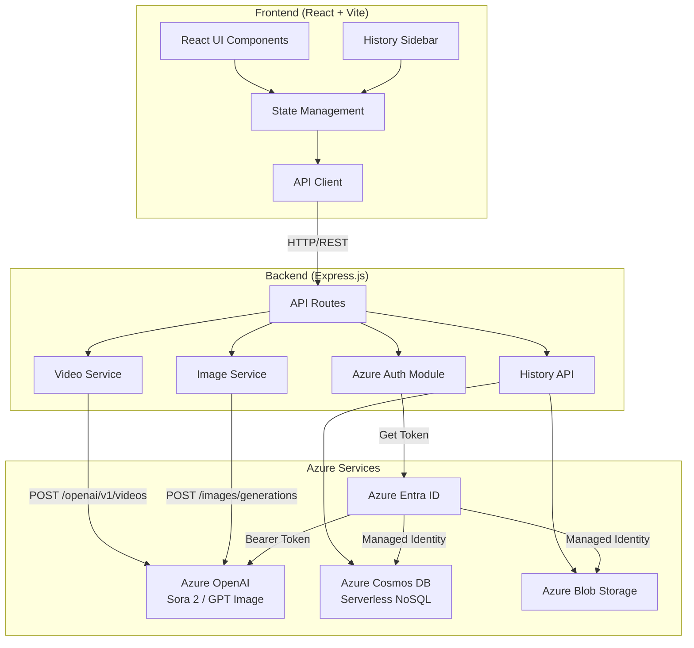

# Let's Sora - AI Media Generation Platform

A modern, beautiful React application for generating AI-powered videos and images using Azure OpenAI's Sora 2 and GPT Image models with EntraID (Azure AD) authentication, conversation history, and clipboard image paste support.


## 🎯 Features

- 🎬 **AI Video Generation** - Generate stunning videos from text prompts using Sora 2
- 🖼️ **AI Image Generation** - Create high-quality images using GPT Image
- 📋 **Clipboard Paste** - Paste images directly into the prompt area as grounding images
- 📜 **Conversation History** - Browse, reload, and delete past generations (persisted in Cosmos DB)
- 🔐 **Secure Authentication** - Uses Azure DefaultAzureCredential for EntraID authentication
- 🎨 **Modern UI** - Beautiful glassmorphism design with smooth animations
- 📱 **Responsive** - Works on desktop and mobile devices
- ⬇️ **Easy Download** - Download generated media with one click
- ⚙️ **Customizable** - Choose media size and video duration

## 🏗️ Architecture



## 📁 Project Structure

```
LetsSora/
├── client/                    # React frontend
│   ├── src/
│   │   ├── App.jsx           # Main application component
│   │   ├── components/
│   │   │   └── HistorySidebar.jsx  # History sidebar component
│   │   ├── main.jsx          # Entry point
│   │   └── index.css         # Global styles
│   ├── index.html
│   ├── vite.config.js        # Vite configuration with proxy
│   ├── tailwind.config.js
│   └── package.json
│
├── server/                    # Express backend
│   ├── index.js              # Server entry point & API routes
│   ├── db.js                 # Cosmos DB data layer
│   ├── storage.js            # Azure Blob Storage client
│   └── package.json
│
├── infra/                     # Azure infrastructure (Bicep)
│   ├── main.bicep            # Main orchestrator template
│   ├── main.bicepparam       # Parameter values
│   ├── modules/
│   │   ├── appServicePlan.bicep
│   │   ├── webApp.bicep
│   │   ├── cosmosDb.bicep
│   │   ├── storageAccount.bicep
│   │   └── roleAssignment.bicep
│   └── README.md
│
├── scripts/
│   └── deploy.ps1            # PowerShell zip-deploy script
│
├── docs/
│   └── architecture.md       # Detailed architecture docs
│
├── Dockerfile                # Multi-stage Docker build
├── package.json              # Root package.json with scripts
└── README.md
```

## 🔧 Tech Stack

### Frontend
| Technology | Purpose |
|------------|---------|
| React 18 | UI library |
| Vite 5 | Build tool and dev server |
| Tailwind CSS 3 | Utility-first CSS framework |
| Framer Motion | Animation library |
| Lucide React | Icon library |

### Backend
| Technology | Purpose |
|------------|---------|
| Express.js 4 | Web framework |
| @azure/identity | Azure authentication (DefaultAzureCredential) |
| @azure/cosmos | Cosmos DB client |
| @azure/storage-blob | Blob Storage client |
| openai SDK | Azure OpenAI API client |

### Azure Services
| Service | Purpose |
|---------|---------|
| Azure App Service (Linux) | Hosts the application |
| Azure OpenAI | Sora 2 video + GPT Image generation |
| Azure Cosmos DB (Serverless) | Conversation history persistence |
| Azure Blob Storage | Full-resolution media storage |
| Azure Entra ID | Managed identity authentication |

## 🚀 Quick Start (Local Development)

### Prerequisites

- Node.js 22+ (LTS) installed
- Azure CLI installed and logged in (`az login`)
- Azure subscription with:
  - Azure OpenAI resource with Sora 2 and GPT Image models deployed
  - **Cognitive Services User** role assigned to your user account

### 1. Install Dependencies

```bash
npm run install:all
```

### 2. Configure Environment

Edit `server/.env` with your Azure endpoints:

```env
AZURE_OPENAI_ENDPOINT=https://<your-resource>.openai.azure.com
AZURE_FOUNDRY_ENDPOINT=https://<your-resource>.services.ai.azure.com
SORA_MODEL_DEPLOYMENT=sora-2
IMAGE_MODEL_DEPLOYMENT=gpt-image-1.5
PORT=3001

# Optional — enable history persistence locally
COSMOS_DB_ENDPOINT=https://<your-cosmos>.documents.azure.com:443/
AZURE_STORAGE_ACCOUNT_NAME=<your-storage-account>
```

> **Important:** Do **not** include `/openai/v1/` in `AZURE_OPENAI_ENDPOINT` — the server appends this automatically.

### 3. Azure Authentication

```bash
az login
az account set --subscription <your-subscription-id>
```

The server uses `DefaultAzureCredential`, which picks up your `az login` session. If you prefer API key auth, set `AZURE_OPENAI_API_KEY` in `.env` instead.

### 4. Local Permissions for Cosmos DB & Blob Storage (Optional)

If you want history persistence locally, your Azure identity needs data-plane roles on those resources:

**Cosmos DB** — requires a Cosmos DB built-in role (not standard Azure RBAC):

```powershell
$myPrincipalId = (az ad signed-in-user show --query id -o tsv)
$cosmosAccountId = (az cosmosdb show --name <cosmos-account> --resource-group <rg> --query id -o tsv)

az cosmosdb sql role assignment create `
  --account-name <cosmos-account> `
  --resource-group <rg> `
  --role-definition-id "00000000-0000-0000-0000-000000000002" `
  --principal-id $myPrincipalId `
  --scope $cosmosAccountId
```

**Blob Storage** — requires `Storage Blob Data Contributor`:

```powershell
az role assignment create `
  --assignee-object-id $myPrincipalId `
  --assignee-principal-type User `
  --role "Storage Blob Data Contributor" `
  --scope (az storage account show --name <storage-account> --resource-group <rg> --query id -o tsv)
```

> Without these roles, the app still works — history and media uploads are simply disabled.

### 5. Run the Application

```bash
npm run dev
```

### 6. Open the App

Visit [http://localhost:3000](http://localhost:3000)

- **Client** runs on port 3000 (Vite dev server, proxies `/api` to the server)
- **Server** runs on port 3001 (Express, `--watch` for auto-reload)

---

## ☁️ Azure Deployment (Step-by-Step)

Follow these steps **in order** to deploy to Azure App Service with full infrastructure.

### Prerequisites

- Azure CLI installed and authenticated (`az login`)
- Node.js 20+ installed locally (for building the client)
- PowerShell 7+ (for the deploy script)
- An Azure AI Foundry project with Sora 2 and GPT Image models deployed
- Contributor role on your Azure subscription

### Step 1: Configure Parameters

Edit `infra/main.bicepparam` with your values:

```bicep
using './main.bicep'

param appName = 'letssora'               // Base name — a unique suffix is auto-appended
param environment = 'dev'
param location = 'australiaeast'          // Your preferred Azure region
param appServicePlanSku = 'P2v3'          // P2v3 for production, B1 for dev/test

// Your AI Foundry project resource ID (find in Azure Portal → AI Foundry → Properties)
param aiFoundryProjectId = '/subscriptions/{sub-id}/resourceGroups/{rg}/providers/Microsoft.CognitiveServices/accounts/{account}/projects/{project}'

// Your Azure OpenAI endpoint (without trailing slash)
param azureOpenAiEndpoint = 'https://<your-resource>.openai.azure.com'

// Your Azure AI Foundry endpoint
param azureFoundryEndpoint = 'https://<your-resource>.services.ai.azure.com'

// Model deployment names (must match what you deployed in AI Foundry)
param soraModelDeployment = 'sora-2'
param imageModelDeployment = 'gpt-image-1'

// Set to true if the AI Foundry project is in a different subscription/tenant
param skipAiRoleAssignment = true
```

> **Note:** Resource names are automatically made unique by appending a hash of the resource group ID (e.g. `app-letssora-dev-a1b2c3d4e5f6g`). You do not need to worry about name collisions — deploying to different resource groups creates different names automatically.

### Step 2: Create Resource Group

```powershell
az login
az account set --subscription "<your-subscription-id>"
az group create --name rg-letssora-dev --location australiaeast
```

### Step 3: Provision Infrastructure

This creates the App Service Plan, Web App, Cosmos DB (serverless), Storage Account, and role assignments.

```powershell
# Preview the changes first
az deployment group what-if `
  --resource-group rg-letssora-dev `
  --template-file infra/main.bicep `
  --parameters infra/main.bicepparam

# Deploy (takes 3-5 minutes)
az deployment group create `
  --resource-group rg-letssora-dev `
  --template-file infra/main.bicep `
  --parameters infra/main.bicepparam
```

**Resources created:**
| Resource | Name Pattern | Purpose |
|----------|-------------|---------|
| App Service Plan | `asp-{appName}-{env}` | Compute host |
| Web App | `app-{appName}-{env}` | Application with managed identity |
| Cosmos DB | `cosmos-{appName}-{env}` | Conversation history (serverless, NoSQL) |
| Storage Account | `st{appName}{env}` | Media blob storage |
| Role Assignments | — | Cosmos DB Data Contributor + Storage Blob Data Contributor |

### Step 4: Assign AI Foundry Role (if `skipAiRoleAssignment = true`)

If your AI Foundry project is in a different subscription or tenant, you skipped the automatic role assignment. Assign it manually using the `$principalId` from Step 3:

```powershell
# If you didn't capture it in Step 3, get it from the deployment output:
$principalId = (az deployment group show `
  --resource-group rg-letssora-dev `
  --name main `
  --query properties.outputs.webAppPrincipalId.value -o tsv)

# Assign "Cognitive Services User" role on your AI Foundry resource
az role assignment create `
  --assignee-object-id $principalId `
  --assignee-principal-type ServicePrincipal `
  --role "Cognitive Services User" `
  --scope "/subscriptions/{ai-foundry-sub-id}/resourceGroups/{ai-foundry-rg}/providers/Microsoft.CognitiveServices/accounts/{ai-foundry-account}"
```

### Step 5: Deploy Application Code

Use the web app name from the deployment output (Step 3):

```powershell
# If you didn't capture it in Step 3:
$webAppName = (az deployment group show `
  --resource-group rg-letssora-dev `
  --name main `
  --query properties.outputs.webAppName.value -o tsv)

# Deploy the app
.\scripts\deploy.ps1 -ResourceGroupName "rg-letssora-dev" -WebAppName $webAppName
```

This will:
1. Build the React client with Vite
2. Package server source + client dist into a zip (no `node_modules`)
3. Deploy to Azure App Service (Oryx installs dependencies on the server)

> **Note:** First deployment takes 3-5 minutes while Oryx installs npm packages.

### Step 6: Verify Deployment

```powershell
# Get the hostname from deployment output
$hostName = (az deployment group show `
  --resource-group rg-letssora-dev `
  --name main `
  --query properties.outputs.webAppHostName.value -o tsv)

# Check the health endpoint
Invoke-RestMethod "https://$hostName/api/health"

# Expected response:
# status: ok, cosmosDb: true, blobStorage: true

# Stream live logs (useful for debugging)
az webapp log tail --resource-group rg-letssora-dev --name $webAppName
```

Visit `https://$hostName` — the app should load.

### Redeployment (Code Changes Only)

After making code changes, you only need to re-run Step 5:

```powershell
$webAppName = (az deployment group show `
  --resource-group rg-letssora-dev `
  --name main `
  --query properties.outputs.webAppName.value -o tsv)

.\scripts\deploy.ps1 -ResourceGroupName "rg-letssora-dev" -WebAppName $webAppName

# Skip client build if only server files changed:
.\scripts\deploy.ps1 -ResourceGroupName "rg-letssora-dev" -WebAppName $webAppName -SkipClientBuild
```

---

## 📖 Usage

1. **Select Mode** - Choose between Video or Image generation
2. **Enter a Prompt** - Describe what you want to create
3. **Paste Images** (Optional) - Paste images from clipboard (Ctrl+V) as grounding images
4. **Configure Settings** (Optional) - Customize size and duration
5. **Generate** - Click the generate button and wait
6. **Download** - Preview and download your media
7. **History** - Click the sidebar toggle to browse past generations

## 📝 API Endpoints

| Endpoint | Method | Description |
|----------|--------|-------------|
| `/api/health` | GET | Health check (includes Cosmos DB & Blob Storage status) |
| `/api/generate-video` | POST | Start video generation (async) |
| `/api/generate-image` | POST | Generate image (sync) |
| `/api/video-status/:id` | GET | Check video generation status |
| `/api/video-content/:id` | GET | Get generated video content |
| `/api/download-video` | GET | Proxy for video download |
| `/api/generations` | GET | List all saved generations |
| `/api/generations/:id` | GET | Get a specific generation |
| `/api/generations/:id` | DELETE | Delete a generation and its media |
| `/api/save-generation` | POST | Save a generation to history |

## 🎨 Coding Style Guide

### JavaScript/React

- **ES6+ Features**: Use modern JavaScript (arrow functions, destructuring, async/await)
- **Functional Components**: Prefer functional components with hooks
- **Named Exports**: Use named exports for components and utilities

```javascript
// ✅ Good
const MyComponent = ({ title, onAction }) => {
  const [state, setState] = useState(null);
  
  const handleClick = useCallback(() => {
    onAction(state);
  }, [state, onAction]);
  
  return <button onClick={handleClick}>{title}</button>;
};
```

### Backend (Express)

- **Async/Await**: Use async/await for asynchronous operations
- **Error Handling**: Always wrap async routes in try/catch
- **Logging**: Log important operations for debugging

```javascript
// ✅ Good
app.post('/api/endpoint', async (req, res) => {
  try {
    const { param } = req.body;
    console.log(`Processing: ${param}`);
    const result = await someAsyncOperation(param);
    res.json({ success: true, data: result });
  } catch (error) {
    console.error('Error:', error.message);
    res.status(500).json({ error: 'Internal server error' });
  }
});
```

### Git Commits

Use conventional commit messages:
- `feat:` New features
- `fix:` Bug fixes
- `docs:` Documentation
- `style:` Code style changes
- `refactor:` Code refactoring

## 🔐 Security

- **No API Keys in Code**: Uses Azure Entra ID (DefaultAzureCredential)
- **Environment Variables**: Sensitive config in `.env` (not committed)
- **CORS**: Properly configured for development

## 🐛 Troubleshooting

### "Application Error" after deployment
The app code hasn't been deployed yet, or the startup failed. Deploy code with `deploy.ps1` and check logs:
```powershell
az webapp log tail -g rg-letssora-dev -n app-letssora2-dev
```

### "Website with given name already exists"
App Service names are globally unique. Change `param appName` in `main.bicepparam` to a unique value.

### "CrossTenantDeploymentNotPermitted"
Set `param skipAiRoleAssignment = true` in `main.bicepparam` and assign the AI Foundry role manually (see Step 4 above).

### Health endpoint shows `cosmosDb: false` or `blobStorage: false`
- Ensure the Cosmos DB and Storage Account deployed successfully
- Check that role assignments completed (Cosmos DB Data Contributor, Storage Blob Data Contributor)
- Managed identity propagation can take a few minutes after deployment

### Authentication Errors
```bash
az login
```
Ensure your managed identity (or your user for local dev) has the **Cognitive Services User** role on the AI resource.

### CORS Issues (local dev)
Both servers must be running (`npm run dev`). Vite proxies `/api` to the backend on port 3001.

### Generation Takes Too Long
- Video: Can take several minutes (async polling)
- Image: Can take 30-120 seconds (sync request)

## 📄 License

MIT

## 🤝 Contributing

1. Fork the repository
2. Create a feature branch (`git checkout -b feature/amazing-feature`)
3. Commit changes (`git commit -m 'feat: add amazing feature'`)
4. Push to branch (`git push origin feature/amazing-feature`)
5. Open a Pull Request
