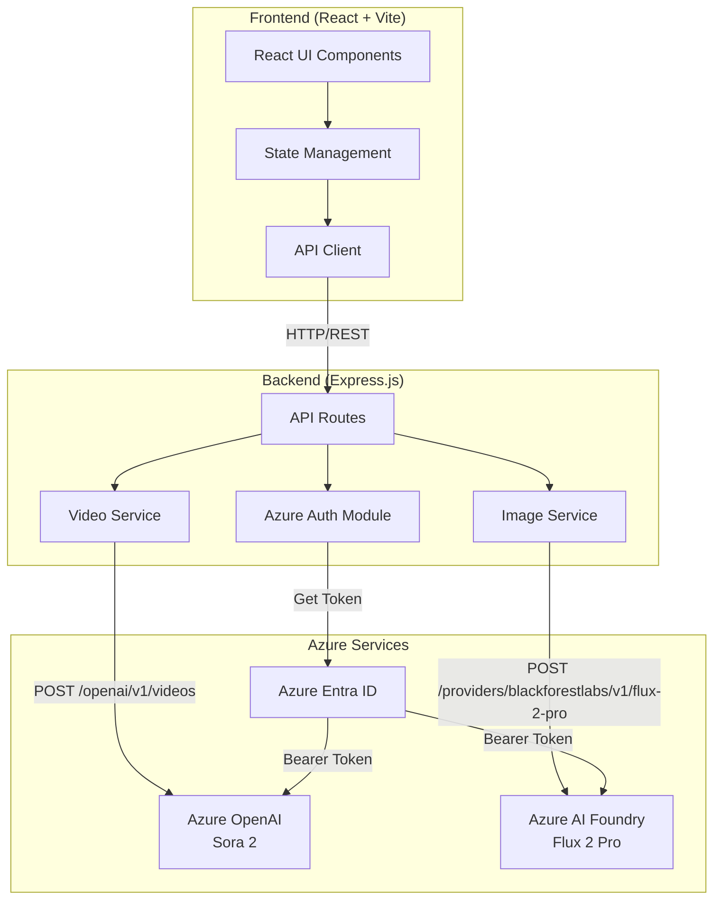

# Let's Sora - AI Media Generation Platform

A modern, beautiful React application for generating AI-powered videos and images using Azure OpenAI's Sora 2 model and Black Forest Labs' Flux 2 Pro model with EntraID (Azure AD) authentication.


## 🎯 Features

- 🎬 **AI Video Generation** - Generate stunning videos from text prompts using Sora 2
- 🖼️ **AI Image Generation** - Create high-quality images using Flux 2 Pro
- 🔐 **Secure Authentication** - Uses Azure DefaultAzureCredential for EntraID authentication
- 🎨 **Modern UI** - Beautiful glassmorphism design with smooth animations
- 📱 **Responsive** - Works on desktop and mobile devices
- ⬇️ **Easy Download** - Download generated media with one click
- ⚙️ **Customizable** - Choose media size and video duration

## 🏗️ Architecture



## 📁 Project Structure

```
LetsSora/
├── client/                    # React frontend
│   ├── src/
│   │   ├── App.jsx           # Main application component
│   │   ├── App.css           # Component styles
│   │   ├── main.jsx          # Entry point
│   │   └── index.css         # Global styles
│   ├── index.html
│   ├── vite.config.js        # Vite configuration with proxy
│   ├── tailwind.config.js
│   └── package.json
│
├── server/                    # Express backend
│   ├── index.js              # Server entry point & API routes
│   ├── .env                  # Environment configuration
│   └── package.json
│
├── docs/                      # Documentation
│   └── architecture.md       # Detailed architecture docs
│
├── package.json              # Root package.json with scripts
├── .gitignore
└── README.md
```

## 🔧 Tech Stack

### Frontend
| Technology | Purpose |
|------------|---------|
| React 18 | UI library |
| Vite | Build tool and dev server |
| Tailwind CSS | Utility-first CSS framework |
| Framer Motion | Animation library |
| Lucide React | Icon library |

### Backend
| Technology | Purpose |
|------------|---------|
| Express.js | Web framework |
| @azure/identity | Azure authentication |
| Node.js Fetch API | HTTP client |
| dotenv | Environment configuration |

### Azure Services
| Service | Purpose |
|---------|---------|
| Azure OpenAI | Sora 2 video generation |
| Azure AI Foundry | Flux 2 Pro image generation |
| Azure Entra ID | Authentication |

## 🚀 Quick Start

### Prerequisites

- Node.js 18+ installed
- Azure subscription with:
  - Azure OpenAI resource with Sora 2 deployed
  - Azure AI Foundry resource with Flux 2 Pro deployed
- Azure CLI installed and logged in (`az login`)

### 1. Install Dependencies

```bash
# Install all dependencies (root, client, and server)
npm run install:all
```

### 2. Configure Environment

Edit `server/.env` with your Azure endpoints:

```env
# Azure OpenAI Configuration
AZURE_OPENAI_ENDPOINT=https://<your-resource>.openai.azure.com
SORA_MODEL_DEPLOYMENT=sora-2

# Azure AI Foundry Flux Configuration
AZURE_FOUNDRY_ENDPOINT=https://<your-resource>.services.ai.azure.com
FLUX_MODEL_DEPLOYMENT=FLUX.2-pro

PORT=3001
```

### 3. Azure Authentication

```bash
az login
```

### 4. Run the Application

```bash
npm run dev
```

### 5. Open the App

Visit [http://localhost:3000](http://localhost:3000)

## 📖 Usage

1. **Select Mode** - Choose between Video or Image generation
2. **Enter a Prompt** - Describe what you want to create
3. **Configure Settings** (Optional) - Customize size and duration
4. **Generate** - Click the generate button and wait
5. **Download** - Preview and download your media

## 📝 API Endpoints

| Endpoint | Method | Description |
|----------|--------|-------------|
| `/api/health` | GET | Health check |
| `/api/generate-video` | POST | Start video generation |
| `/api/generate-image` | POST | Generate image (sync) |
| `/api/video-status/:id` | GET | Check video generation status |
| `/api/video-content/:id` | GET | Get generated video content |
| `/api/download-video` | GET | Proxy for video download |

## 🎨 Coding Style Guide

### JavaScript/React

- **ES6+ Features**: Use modern JavaScript (arrow functions, destructuring, async/await)
- **Functional Components**: Prefer functional components with hooks
- **Named Exports**: Use named exports for components and utilities

```javascript
// ✅ Good
const MyComponent = ({ title, onAction }) => {
  const [state, setState] = useState(null);
  
  const handleClick = useCallback(() => {
    onAction(state);
  }, [state, onAction]);
  
  return <button onClick={handleClick}>{title}</button>;
};
```

### Backend (Express)

- **Async/Await**: Use async/await for asynchronous operations
- **Error Handling**: Always wrap async routes in try/catch
- **Logging**: Log important operations for debugging

```javascript
// ✅ Good
app.post('/api/endpoint', async (req, res) => {
  try {
    const { param } = req.body;
    console.log(`Processing: ${param}`);
    const result = await someAsyncOperation(param);
    res.json({ success: true, data: result });
  } catch (error) {
    console.error('Error:', error.message);
    res.status(500).json({ error: 'Internal server error' });
  }
});
```

### Git Commits

Use conventional commit messages:
- `feat:` New features
- `fix:` Bug fixes
- `docs:` Documentation
- `style:` Code style changes
- `refactor:` Code refactoring

## 🔐 Security

- **No API Keys in Code**: Uses Azure Entra ID (DefaultAzureCredential)
- **Environment Variables**: Sensitive config in `.env` (not committed)
- **CORS**: Properly configured for development

## 🐛 Troubleshooting

### Authentication Errors
```bash
az login
```
Ensure your account has **Cognitive Services User** role.

### CORS Issues
Both servers must be running. Vite proxies `/api` to the backend.

### Generation Takes Too Long
- Video: Can take several minutes (async polling)
- Image: Can take 30-120 seconds (sync request)

## 📄 License

MIT

## 🤝 Contributing

1. Fork the repository
2. Create a feature branch (`git checkout -b feature/amazing-feature`)
3. Commit changes (`git commit -m 'feat: add amazing feature'`)
4. Push to branch (`git push origin feature/amazing-feature`)
5. Open a Pull Request
