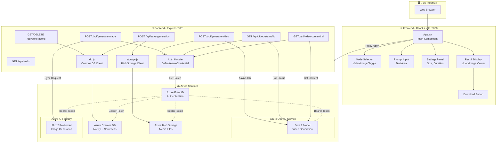
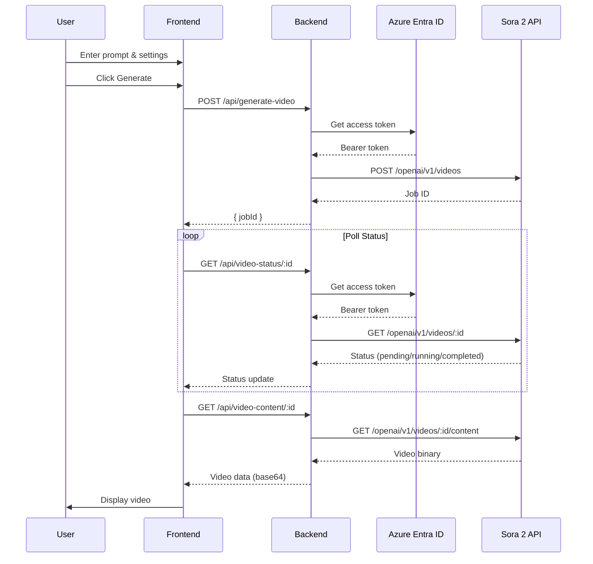
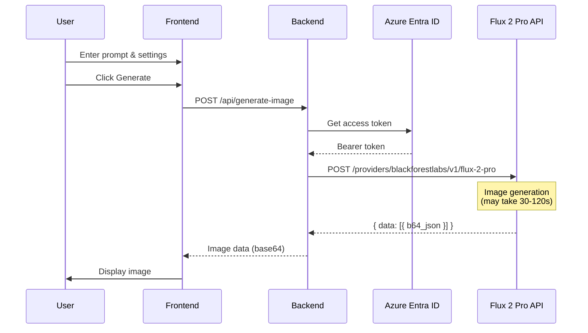
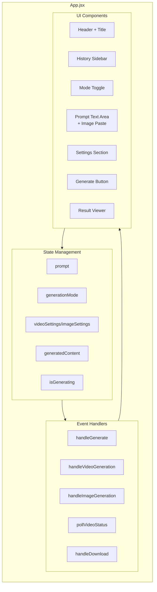
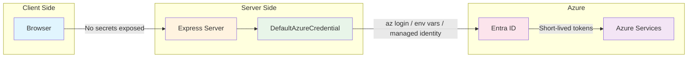

# LetsSora Architecture Documentation

## System Overview

LetsSora is a full-stack web application that enables users to generate AI-powered videos and images using Azure's cloud services.

## Architecture Diagram

## Data Flow

### Video Generation Flow

### Image Generation Flow

## Component Architecture

## Technology Decisions

| Component | Technology | Rationale |
|-----------|------------|-----------|
| Frontend Framework | React 18 | Industry standard, large ecosystem |
| Build Tool | Vite | Fast HMR, modern ES modules |
| Styling | Tailwind CSS | Rapid prototyping, consistent design |
| Animations | Framer Motion | Smooth, declarative animations |
| Backend | Express.js | Simple, flexible, well-documented |
| Database | Azure Cosmos DB (NoSQL, Serverless) | Low-latency, auto-scale, serverless billing |
| Media Storage | Azure Blob Storage | Scalable, cost-effective for images/videos |
| Authentication | @azure/identity | Official SDK, supports multiple auth methods |
| HTTP Client | Fetch API | Native, no dependencies needed |

## Security Model

## Environment Configuration

| Variable | Description | Example |
|----------|-------------|---------|
| `AZURE_OPENAI_ENDPOINT` | Azure OpenAI endpoint URL | `https://xxx.openai.azure.com` |
| `SORA_MODEL_DEPLOYMENT` | Sora 2 deployment name | `sora-2` |
| `AZURE_FOUNDRY_ENDPOINT` | Azure AI Foundry endpoint | `https://xxx.services.ai.azure.com` |
| `FLUX_MODEL_DEPLOYMENT` | Flux deployment name | `FLUX.2-pro` |
| `PORT` | Backend server port | `3001` |
| `COSMOS_DB_ENDPOINT` | Cosmos DB account endpoint | `https://cosmos-letssora-dev.documents.azure.com:443/` |
| `COSMOS_DB_DATABASE` | Cosmos DB database name | `letssora` |
| `AZURE_STORAGE_ACCOUNT_NAME` | Blob Storage account name | `stletssoradev` |
| `AZURE_STORAGE_CONTAINER_NAME` | Blob container name | `media` |
